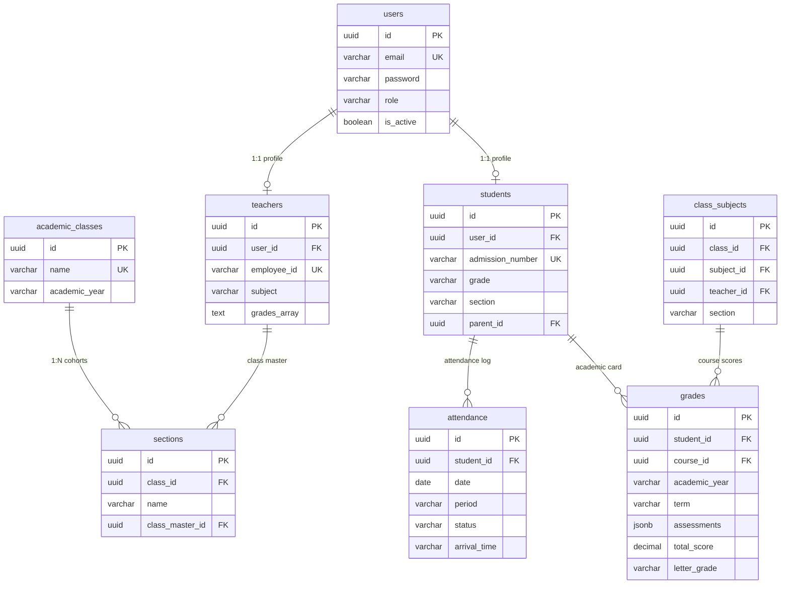

# UHAS-Basic School Management System

## Complete System Architecture & Operational Manual

Welcome to the official system manual and architectural blueprint for the **UHAS-Basic School Management System**. This document provides an extensive, comprehensive, and file-by-file breakdown of the entire platform. It serves as the single source of truth for understanding the codebase structure, database schemas, relational connections, API routes, premium styling standards, and the recent database-level house section standardizations.

---

## 1. Executive Summary & Design Vision

The **UHAS-Basic School Management System** is a hyper-premium, enterprise-grade educational management platform designed for student lifecycle administration, curriculum management, daily attendance intelligence, exams grading, and cognitive report generation.

### System Pillars:

1.  **Visual Excellence & Premium Styling**: Utilizes curated HSL color schemes, soft glassmorphism containers, modern sans-serif typography (Outfit & Inter), responsive hover states, and fluid micro-animations.
2.  **Strict Security & Auditing**: Secured using JSON Web Token (JWT) auth headers, role-based protection routes, and PostgreSQL Row-Level Security (RLS) policies.
3.  **Relational Database Integrity**: Fully backed by Supabase with transactional foreign keys and deterministic data mapping.
4.  **Institutional Section Color Coding**: All class streams are standardized under traditional institutional house colors instead of generic alphanumeric codes:
    - **Yellow (Y)** (Yellow House)
    - **Green (G)** (Green House)
    - **Red (R)** (Red House)
    - **Blue (B)** (Blue House)

---

## 2. Directory Tree & Codebase Layout

The workspace is organized into a clean, separated multi-tier structure:

```
school-management-system/
├── client/                         # Vite + React (Frontend SPA)
│   ├── public/                     # Static media, logo and favicon assets
│   ├── src/
│   │   ├── components/             # Reusable UI component elements
│   │   │   ├── common/             # Custom forms, widgets and calendar engines
│   │   │   │   ├── PremiumCalendar.jsx   # Customizable daily calendar component
│   │   │   │   ├── PremiumDatePicker.jsx # Soft glassmorphic Date Picker
│   │   │   │   └── PremiumSelect.jsx     # Dropdown input supporting mapped options
│   │   │   └── layout/             # Structure shell wrappers
│   │   │       ├── RoleBasedSidebar.jsx  # Contextual sidebar routing nodes
│   │   │       └── TopNav.jsx            # Dynamic page header with user profiles
│   │   ├── context/                # Global react state providers
│   │   │   ├── AlertContext.jsx    # Custom confirmation alerts and prompts
│   │   │   └── AuthContext.jsx     # Handles user sessions, logins & tokens
│   │   ├── pages/                  # Visual modules & application views
│   │   │   ├── Attendance/
│   │   │   │   └── Attendance.jsx  # Daily attendance tracking & audit
│   │   │   ├── Classes/
│   │   │   │   └── Classes.jsx     # Class segments config grid
│   │   │   ├── Courses/
│   │   │   │   └── Courses.jsx     # Curriculum allocation matrix
│   │   │   ├── Dashboard/          # Custom homepages per system role
│   │   │   │   ├── AdminDashboard.jsx
│   │   │   │   ├── ParentDashboard.jsx
│   │   │   │   ├── StudentDashboard.jsx
│   │   │   │   └── TeacherDashboard.jsx
│   │   │   ├── Exams/
│   │   │   │   └── MarksEntry/
│   │   │   │       └── MarksEntry.jsx # Subject grading scoreboards
│   │   │   ├── Parents/            # Family directories and linkages
│   │   │   ├── Reports/            # Academic report sheet renderers
│   │   │   │   ├── Reports.jsx     # Individual student report card generator
│   │   │   │   ├── FinancialReports.jsx
│   │   │   │   └── StaffReports.jsx
│   │   │   ├── Sections/
│   │   │   │   └── Sections.jsx    # Class stream assignments & master teachers
│   │   │   ├── Students/
│   │   │   │   ├── AddStudent/
│   │   │   │   │   └── AddStudent.jsx # Student admission wizard
│   │   │   │   ├── PromoteStudents/
│   │   │   │   │   └── PromoteStudents.jsx # Cohort promotional engines
│   │   │   │   ├── StudentProfile/
│   │   │   │   └── Students.jsx    # Institutional student roster
│   │   │   ├── Teachers/
│   │   │   │   └── TeacherProfile/
│   │   │   └── Timetable/
│   │   │       └── Timetable.jsx   # Stream scheduling calendars
│   │   ├── services/
│   │   │   └── api.js              # Standardized Axios requests interceptor
│   │   └── utils/
│   │       └── sectionHelper.js    # Centralized house-section mapping util
│   ├── package.json
│   └── vite.config.js
│
├── server/                         # Express.js REST API Server
│   ├── config/                     # Backend config setups
│   │   └── db.js                   # Supabase connection init block
│   ├── controllers/                # Core business execution layers
│   │   ├── attendanceController.js # Presence records processor
│   │   ├── authController.js       # Security handshakes & profiles
│   │   ├── studentController.js    # Student admission & promotions
│   │   └── teacherController.js    # Teacher schedules & assignments
│   ├── db/
│   │   ├── seed-supabase.js        # Seed engine injecting mock datasets
│   │   └── seed-finance.js
│   ├── middleware/
│   │   └── auth.js                 # JWT decryptor & role verification
│   ├── models/                     # Custom request validation schemas
│   ├── routes/                     # Express REST endpoints
│   ├── server.js                   # Application server entry point
│   └── package.json
│
└── supabase/                       # Database Configuration Layer
    └── schema.sql                  # Relational table configurations
```

---

## 3. Database Relational Architecture (Supabase / PostgreSQL)

The system relies on a clean, normalized relational model with secure Row Level Security (RLS) constraints to guarantee cross-tenant isolation and strict authorization.

### Database Tables Overview:



### Table Definitions & Integrity Safeguards:

1.  **`users`**:
    - Acts as the central identity container. Passwords are encrypted utilizing `bcrypt` (10 rounds).
2.  **`academic_classes`**:
    - Holds the structural grade classifications (e.g., `JHS 1`, `Primary 4`).
3.  **`sections`**:
    - Represents the individual class divisions (e.g., `JHS 1 Yellow (Y)`). Each division points to a `class_master_id` in the `teachers` table.
4.  **`students`**:
    - Contains student attributes. Keeps track of the student's current tier via `grade` and stream cohort via `section`.
5.  **`class_subjects`**:
    - Acts as the core syllabus allocation join-table linking a class, a specific teaching course, a designated instructor (`teacher_id`), and the class section (`section`).
6.  **`attendance`**:
    - Daily operational registry mapping punctuality states (`present`, `absent`) per time period node.
7.  **`grades`**:
    - Grading assessments storing classwork, homework, midterm, and final examination points under a single `jsonb` column for fluid query extraction.

---

## 4. Operational Walkthrough of Key Functional Modules

### A. Dynamic Attendance Intelligence Register

The Attendance module is a high-density operational center allowing master teachers to log and review daily attendance logs.

- **Punctuality Grace Window**: Incorporates an automated timezone-aware periods detector based on a strict institutional timetable:
  - _Morning Assembly_: 07:30 - 07:45 (5 min late grace window).
  - _Periods 1 to 6_: 45-minute intervals.
  - _Late arrivals_ are automatically color-coded in amber to indicate a warning.
- **State Locking**: Once attendance is submitted, nodemon lock flags are written to prevent subsequent tampering by teaching accounts unless authorized by an admin profile.

### B. Timetable Stream Planner

- **Collision Detection**: The scheduling calendar prevents assigning an instructor to two sections during overlapping period blocks.
- **Default Timetables**: Admins can initialize structured timetables from fallback standard school templates to simplify initial system setups.

### C. Continuous Academic Assessments & Marks Entry

- **Weighted Grade Aggregation**: Grades are tabulated based on standardized weight margins:
  - `Classwork` & `Homework` assessments.
  - `Midterm` & `Final Examinations`.
- **Automatic Remark Indicators**: Scores translate to grade bounds (`A+` to `F`) and remarks (`Excellent`, `Very Good`, `Fail`) dynamically according to rules stored in system configurations.

### D. Automated Multi-Role Dashboard Consolidation

The UI renders a customized workspace tailored specifically to the authenticated profile:

- **Admin Dashboard**: Statistical aggregations (total scholars, overall faculty counts, average attendance curves, tuition payment collection ratios).
- **Teacher Dashboard**: Displays the master class roster, active courses schedules, and shortcuts to mark lists.
- **Student Dashboard**: Visualizes class timetables, upcoming examinations, assignment status, and cognitive report cards.
- **Parent Dashboard**: Links sibling student profiles, showing synchronized attendance rates, active fee balances, and teacher remarks.

---

## 5. Comprehensive Color-Coded House Sections Upgrade

To improve visual clarity and align the system with the school's house system, the legacy single-letter class divisions (`A`, `B`, `C`, `D`) have been replaced with institutional house color names: **Yellow (Y)**, **Green (G)**, **Red (R)**, and **Blue (B)**.

### Core Code Transformations Executed:

#### A. Database Migration & Seed Updates (`seed-supabase.js`):

1.  **Section Seeder Grid**: Seeds class streams using descriptive house names:
    ```javascript
    const sectionNames = ["Yellow (Y)", "Green (G)", "Red (R)", "Blue (B)"];
    sectionNames.forEach((secName, secIdx) => {
      sectionsData.push({
        id: deterministicUUID(`section-${c.name}-${secName}`),
        class_id: c.id,
        name: secName,
        class_master_id: getTId(
          `t${String(((idx + secIdx) % 10) + 1).padStart(3, "0")}`,
        ),
      });
    });
    ```
2.  **Student Roster Seeds**: Distributes students into these new streams:
    ```javascript
    section: num % 2 === 0 ? "Yellow (Y)" : "Green (G)";
    ```
3.  **Timetable Slots**: Mapped timetable entries directly under the `'Yellow (Y)'` section value.

#### B. Unified Helper Setup (`sectionHelper.js`):

Standardizes how section codes are mapped across the frontend:

```javascript
export const mapSectionName = (name) => {
  if (!name) return name;
  const upper = String(name).toUpperCase().trim();
  if (upper === "A" || upper === "Y" || upper === "YELLOW") return "Yellow (Y)";
  if (upper === "B" || upper === "G" || upper === "GREEN") return "Green (G)";
  if (upper === "C" || upper === "R" || upper === "RED") return "Red (R)";
  if (upper === "D" || upper === "B" || upper === "BLUE") return "Blue (B)";
  return name;
};
```

#### C. Comprehensive Frontend Updates:

- **Add Student Form (`AddStudent.jsx`)**: Dropdowns render `Section Yellow (Y)`, `Section Green (G)` for selection while passing database-compatible values to backend APIs.
- **Attendance Console (`Attendance.jsx`)**: Cohort headers, master class badges, and search filters are updated to display house colors instead of alphanumeric codes.
- **Timetable Roster (`Timetable.jsx`)**: Formats streams in class reset alerts and dropdown menus using the house helper.
- **Reports Engine (`Reports.jsx`)**: Integrates custom section display logic on printed report cards and transcript sheets.

---

## 6. Installation, Local Deployment & Testing

To set up the UHAS-Basic School Management System locally:

### 1. Prerequisite Installations

- Ensure **Node.js** (v20.19+ or v22.12+) is installed.
- Verify access to your **Supabase** cloud dashboard.

### 2. Environment Configurations (`.env`)

#### Server Environment (`server/.env`):

```ini
PORT=5001
SUPABASE_URL=https://your-supabase-url.supabase.co
SUPABASE_KEY=your-supabase-service-role-key
JWT_SECRET=your-secure-jwt-secret-string
```

#### Client Environment (`client/.env`):

```ini
VITE_API_URL=http://localhost:5001/api
```

### 3. Server Setup & Database Seeding

Navigate to the server directory, install dependencies, and run the database seeder:

```bash
cd server
npm install
npm run seed:supabase
npm run dev
```

### 4. Client Setup & Deployment

Open a new terminal window, navigate to the client directory, and run the Vite dev server:

```bash
cd client
npm install
npm run dev
```

The React frontend compiles and mounts at **`http://localhost:5173`**.

---

## 7. Operational Verification Checklist

To verify that the system and sections mapping are functioning correctly, complete the following test cases:

- `[ ]` **Admin Login**: Log in with `admin001@uhasbasic.edu.gh` / `admin001uhas_basic_password`. Open the **Sections** sidebar to verify that streams display as `Yellow (Y)`, `Green (G)` rather than legacy letters.
- `[ ]` **Timetable Audit**: Go to the **Timetable** view and click the _Stream_ dropdown to confirm section names are formatted correctly.
- `[ ]` **Enrollment Test**: Open the **Add Student** wizard and check the _Section_ selector to ensure options display as `Section Yellow (Y)`, `Section Green (G)`, etc.
- `[ ]` **Teacher Login**: Log in with `t001@uhasbasic.edu.gh` / `t001uhas_basic_password`. Verify that your **Master Class** displays the formatted house color section name.
- `[ ]` **Attendance Commit**: Open the **Attendance** register as a teacher, select a master class, check that the headers display the mapped section name, modify student statuses, and click **Commit Registry** to verify database updates.
